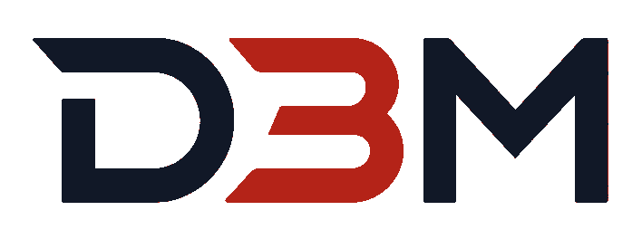
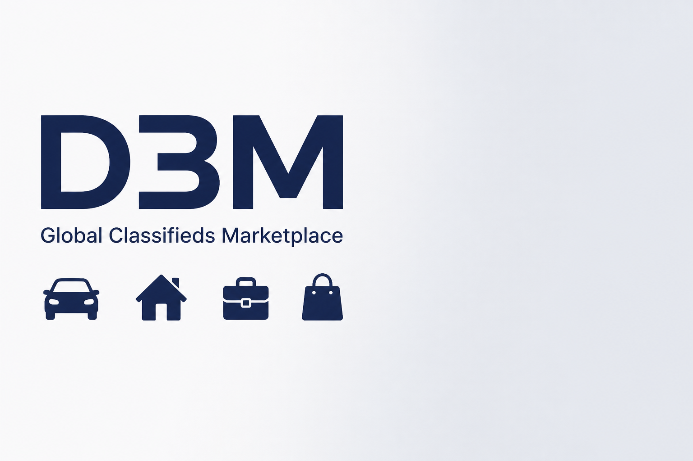
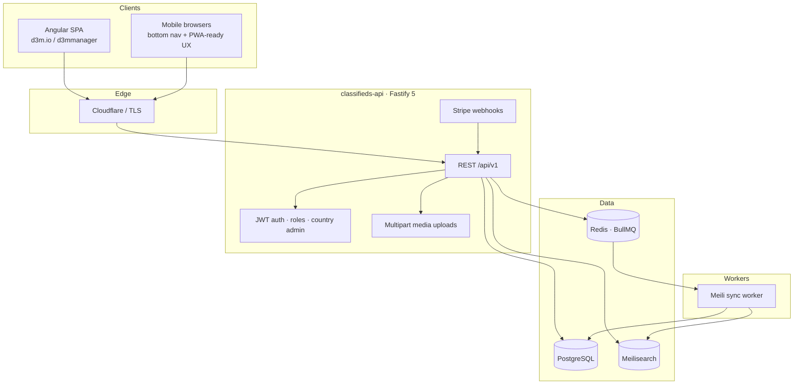
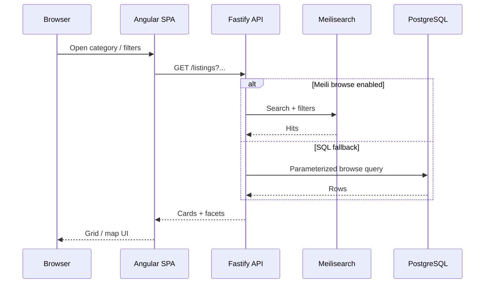
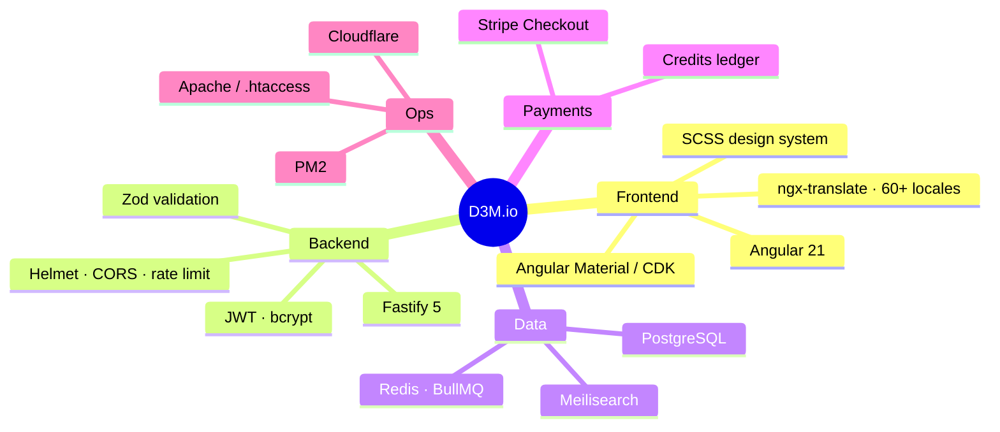

<p align="center">
  
</p>

<h1 align="center">D3M.io</h1>

<p align="center">
  <strong>Global classifieds marketplace</strong> — vehicles, real estate, jobs, services, community & more.<br/>
  Multi-country · multi-language · credit-based publishing · real-time search.
</p>

<p align="center">
  <a href="https://d3m.io"></a>
  <a href="https://api.d3m.io"></a>
  
  
</p>

<p align="center">
  
</p>

---

## Story

**D3M** started as a modern alternative to fragmented local classifieds boards — one product that can run in many markets without rewriting the stack each time.

The platform is built for:

- **Sellers** who need fast listing, promotion credits, and messaging
- **Buyers** who need filters, map/geo search, and trustworthy detail pages
- **Operators** who need country-scoped admin, moderation, and billing controls

Today the live product serves **d3m.io** with a Fastify API at **api.d3m.io**, Angular SPA, PostgreSQL, Meilisearch, Redis, and Stripe-ready credits.

> This public repository is the **product & architecture showcase**.  
> Full source disaster-recovery backup lives in a **private** repo (`d3m-backup`).

---

## Product surface

| Area | What users get |
|------|----------------|
| Marketplace | Goods for sale / rent with rich filters |
| Vehicles | Cars, boats, and catalog-assisted attributes |
| Real estate | Property listings with geo hierarchy |
| Jobs & services | Hiring and local professional services |
| Community | Local notices, lost & found, meetups |
| Messages | Listing-scoped buyer ↔ seller chat |
| Credits & ads | Publish / promote with wallet + Stripe checkout |
| Admin | Country-scoped staff, moderation, users, ads |

<p align="center">
  
  &nbsp;&nbsp;
  
  &nbsp;&nbsp;
  
  &nbsp;&nbsp;
  
</p>

---

## Architecture



### Request path (browse)



---

## Technology stack



| Layer | Choices |
|-------|---------|
| Frontend | Angular 21, standalone components, i18n |
| API | Node.js, Fastify 5, TypeScript, Zod |
| DB | PostgreSQL (category-partitioned listings) |
| Search | Meilisearch + SQL fallback |
| Queue | Redis + BullMQ (index sync) |
| Auth | JWT access/refresh, role + country admin |
| Media | Local uploads → `/api/v1/media/files` |
| Billing | Credits wallet, Stripe when configured |
| Deploy | `d3msource` → `d3m.io` / `d3mmanager`, PM2 API |

---

## Monorepo layout (production tree)

```text
public_html/
├── d3msource/     # Angular source of truth
├── d3mapi/        # Fastify API + workers + migrations
├── d3m.io/        # Production static deploy
├── d3mmanager/    # Staging / manager deploy
└── scripts/       # build, deploy, checkpoint, GitHub backup
```

---

## Status & links

| Resource | URL |
|----------|-----|
| Production | https://d3m.io |
| API | https://api.d3m.io |
| This showcase | https://github.com/salihduzenusa/d3m-io |
| Private DR backup | https://github.com/salihduzenusa/d3m-backup *(private)* |
| Owner | [@salihduzenusa](https://github.com/salihduzenusa) |

---

## Roadmap highlights

- [x] Multi-category classifieds + geo hierarchy
- [x] Meilisearch browse path
- [x] Credits + Stripe checkout path
- [x] Mobile bottom nav / messaging UX
- [ ] Hardened auth (server OTP reset, rotated JWT secrets)
- [ ] Stronger upload MIME sniffing & listing image allowlist
- [ ] Public developer docs / OpenAPI export

---

## License

**Proprietary** — © D3M / salihduzenusa.  
Source and trademarks are not open source. Contact the owner for partnership or licensing.
