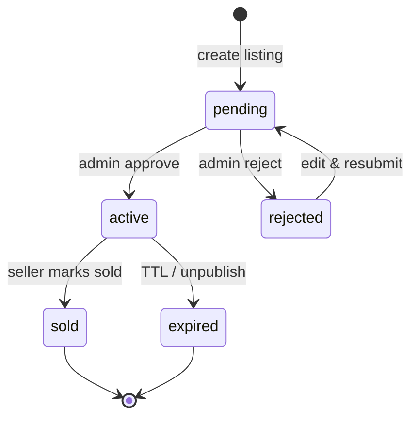
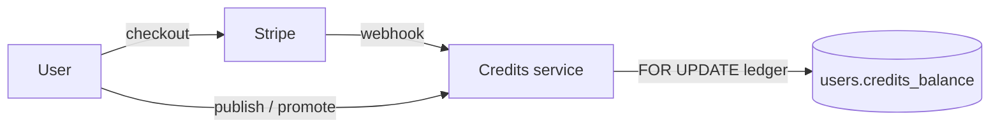

# Architecture notes

## High-level boxes

```text
┌────────────┐   HTTPS    ┌────────────┐   SQL/Meili   ┌────────────┐
│  Angular   │ ─────────► │  Fastify   │ ────────────► │ PostgreSQL │
│  d3m.io    │            │  api.d3m   │               └────────────┘
└────────────┘            │            │ ────────────► ┌────────────┐
                          │            │               │ Meilisearch│
                          │            │ ────────────► └────────────┘
                          │            │               ┌────────────┐
                          │            │ ────────────► │ Redis/MQ   │
                          └────────────┘               └────────────┘
```

## Listing lifecycle



## Credit flow


